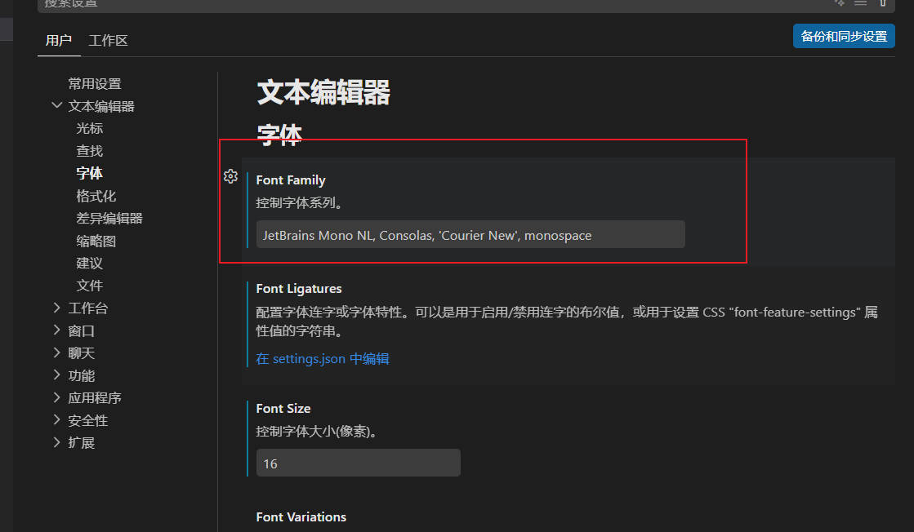
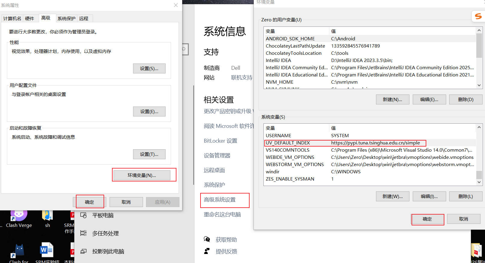
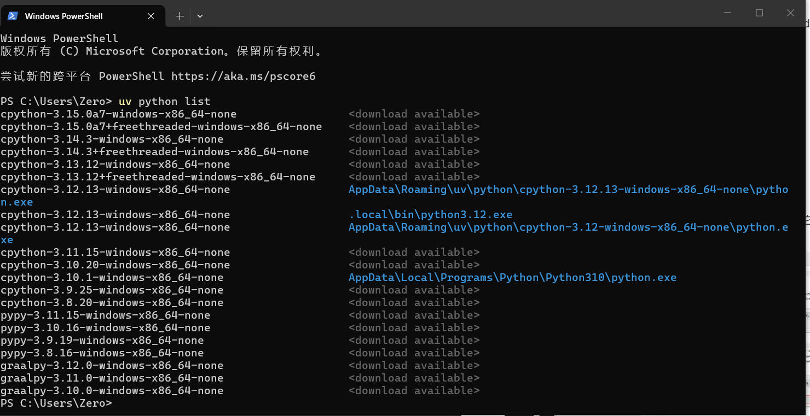
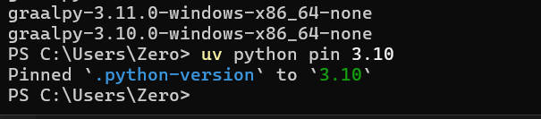
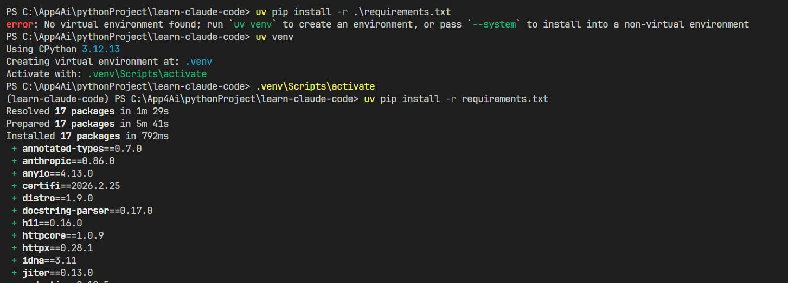

# VSCode 配置与 UV 工具使用指南
## 一、VSCode 字体修改（JetBrains Mono）
### 1. 下载 JetBrains Mono 字体包
前往官方渠道下载 **JetBrains Mono** 字体压缩包，获取字体安装文件。

### 2. 安装 TTF 字体文件
解压下载的字体包，找到包内所有 `.ttf` 格式的字体文件，**全选后右键点击安装**，完成字体在系统中的注册。

### 3. VSCode 字体配置
按照以下路径依次打开 VSCode 设置界面，修改字体配置：
1. 点击 VSCode 左上角 **File（文件）**
2. 选择 **Preferences（首选项）**
3. 打开 **Settings（设置）**
4. 展开 **Text Editor（文本编辑器）**
5. 找到 **Font（字体）** 选项
6. 在 **Font Family（字体族）** 输入框中，删除原有内容，替换为以下配置：
```
JetBrains Mono NL, Consolas, 'Courier New', monospace
```
7. 设置完成后自动保存，VSCode 字体将立即生效。



## 二、VSCode 必备插件推荐
以下是四款实用高频插件，可大幅提升开发效率与使用体验，安装方式：打开 VSCode 扩展面板（Ctrl+Shift+X），搜索插件名称一键安装。
1. **IntelliJ IDEA Keybindings**：兼容 IDEA 快捷键，降低快捷键切换学习成本
2. **Markdown Preview Enhanced**：Markdown 文档增强预览插件，支持实时预览、导出等高级功能
3. **Chinese (Simplified) Language Pack for Visual Studio**：VSCode 简体中文语言包，汉化编辑器界面
4. **Auto Close Tag**：自动闭合 HTML/XML 标签，减少手动编码工作量

## 三、UV 工具安装与使用教程
UV 是一款高效的 Python 包与环境管理工具，以下是完整安装、配置及使用流程。

### 1. 安装 UV
打开终端（CMD/PowerShell），执行以下命令通过 pip 安装 UV：
```bash
pip install uv
```

### 2. UV 换源配置（清华镜像）
为提升包下载速度，配置国内清华镜像源，步骤如下：
1. 右键桌面 **此电脑** → 选择 **属性**
2. 点击 **高级系统设置**
3. 打开 **环境变量**
4. 在「用户变量」或「系统变量」中，点击 **新建**
5. 变量名填写：`UV_DEFAULT_INDEX`
6. 变量值填写：`https://pypi.tuna.tsinghua.edu.cn/simple`
7. 依次点击确定保存配置，**重启终端** 后镜像源生效



### 3. 查看本机 Python 版本
执行命令查看当前系统已安装的 Python 版本：
```bash
uv python list
```



### 4. 安装指定 Python 版本
UV 可快速安装所需 Python 版本，命令如下：
1. 安装单个 Python 版本（以 3.12 为例）：
```bash
uv python install 3.12
```
2. 安装多个 Python 版本（以 3.11、3.12 为例）：
```bash
uv python install 3.11 3.12
```

### 5. 固定 UV 使用的 Python 版本
指定 UV 默认使用的 Python 版本（以 3.12 为例），执行命令：
```bash
uv python pin 3.12
```



### 6. 创建并激活 Python 虚拟环境
直接使用系统 Python 会出现警告，推荐创建虚拟环境隔离项目依赖：
1. 创建虚拟环境：
```bash
uv venv
```
2. Windows 系统激活虚拟环境：
```bash
.venv\Scripts\activate
```
激活成功后，终端前缀会显示 `(.venv)` 标识。



### 7. 安装项目依赖包
激活虚拟环境后，执行命令批量安装项目所需依赖包：
```bash
uv pip install -r requirements.txt
```

### 8. 补充：不使用虚拟环境安装依赖（简易模式）
若无需虚拟环境，可直接添加 `--system` 参数安装依赖：
```bash
uv pip install -r requirements.txt --system
```

### 9. 重新激活虚拟环境
每次退出终端后，重新打开需要运行项目时，**必须重新激活虚拟环境**：
```bash
.venv\Scripts\activate
```